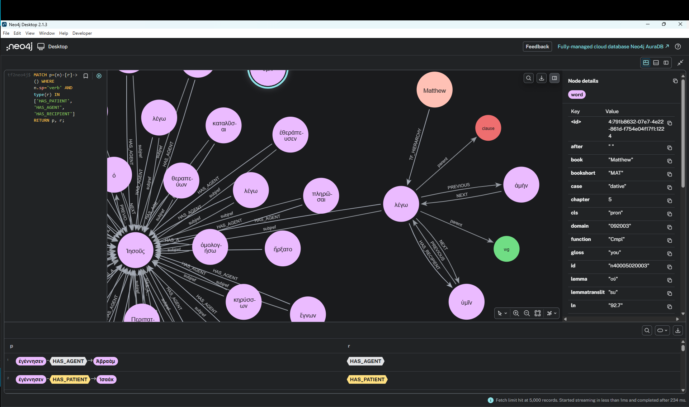

[](https://www.repostatus.org/#concept)
  [](https://creativecommons.org/licenses/by/4.0/)

# tf2neo4j

Jupyter NoteBook: first tool to export a Text-Fabric dataset into Neo4j. The code is more or less generic, although certain parts are tweaked towards the [N1904-TF](https://centerblc.github.io/N1904/) dataset.

## Documentation

Additional docs are available in [`docs/`](./docs/README.md) describing the following aspects:

- Architecture
- Quick start
- Configuration reference
- Graph model
- Troubleshooting

## What it does

- Creates/updates typed TF nodes as `(:<tf_otype> {tf_id, otype, ...features})` (no shared `:TFNode` label)
- Creates one Neo4j relationship type per TF edge-feature
- Optional: converts `frame` roles into semantic relations
  (`A0->HAS_AGENT`, `A1->HAS_PATIENT`, `A2->HAS_RECIPIENT`, `AA2->HAS_ADVERBIAL`)
- Optional: creates locality-based hierarchy edges `[:TF_HIERARCHY]` from a provided ordered type list
- Optional: adds sequential `[:NEXT]` and `[:PREVIOUS]` relationships for selected TF node types
- Supports batched writes and optional batched full database clear before import
- Shows progress during long exports (optional `tqdm`, with print fallback)

## Quick start

1. Install dependencies:
   ```bash
   pip install -r requirements.txt
   ```
2. Start Jupyter:
   ```bash
   jupyter notebook
   ```
3. Open `notebooks/tf_to_neo4j.ipynb`
4. Set `TF_LOCATIONS`, Neo4j credentials, and run all cells

## Python API

```python
from tf2neo4j import TFExportConfig, export_text_fabric_to_neo4j

config = TFExportConfig(
    tf_locations=r"D:\path\to\tf\dataset",
    neo4j_uri="bolt://localhost:7687",
    neo4j_user="neo4j",
    neo4j_password="password",
    neo4j_database="neo4j",
    node_features=None,   # None => all node features
    edge_features=None,   # None => all edge features
    batch_size=2000,
    clear_database=False,
    clear_batch_size=10000,
    add_previous_next=False,
    previous_next_node_types=["verse", "word", "book", "chapter"],
    hierarchy_node_types=["book", "chapter", "verse", "word"],
    frame_semantic_relations=True,
    show_progress=True,
    progress_use_tqdm=True,
    progress_every=50000,
)

stats = export_text_fabric_to_neo4j(config)
print(stats)
```

## Cypher Query example

The Graph can be examined in (for example) the neo4j desktop.  This is an example using the N1904-TF feature [frame](https://centerblc.github.io/N1904/features/frame.html#start) being converted into relations indicating Agent, Patient, etc.



---

## Disclosure

Parts of this repository (code, refactoring, and documentation) were created or improved with assistance from OpenAI Codex.
