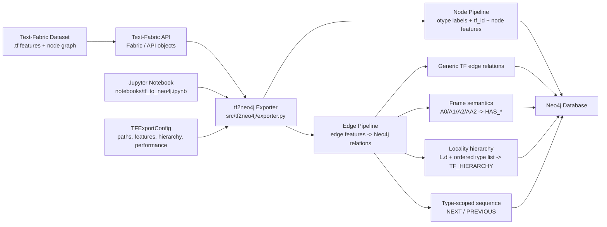

# Architecture

This diagram shows the end-to-end flow from a Text-Fabric dataset to Neo4j.

For a focused view of relation generation logic, see
[Relation Pipeline](./relation-pipeline.md).

```mermaid
flowchart LR
    A["Text-Fabric Dataset<br/>.tf features + node graph"] --> B["Text-Fabric API<br/>Fabric / API objects"]
    B --> C["tf2neo4j Exporter<br/>src/tf2neo4j/exporter.py"]

    C --> D["Node Pipeline<br/>otype labels + tf_id + node features"]
    C --> E["Edge Pipeline<br/>edge features -> Neo4j relations"]

    E --> E1["Generic TF edge relations"]
    E --> E2["Frame semantics<br/>A0/A1/A2/AA2 -> HAS_*"]
    E --> E3["Locality hierarchy<br/>L.d + ordered type list -> TF_HIERARCHY"]
    E --> E4["Type-scoped sequence<br/>NEXT / PREVIOUS"]

    D --> F["Neo4j Database"]
    E1 --> F
    E2 --> F
    E3 --> F
    E4 --> F

    G["Jupyter Notebook<br/>notebooks/tf_to_neo4j.ipynb"] --> C
    H["TFExportConfig<br/>paths, features, hierarchy, performance"] --> C
```
