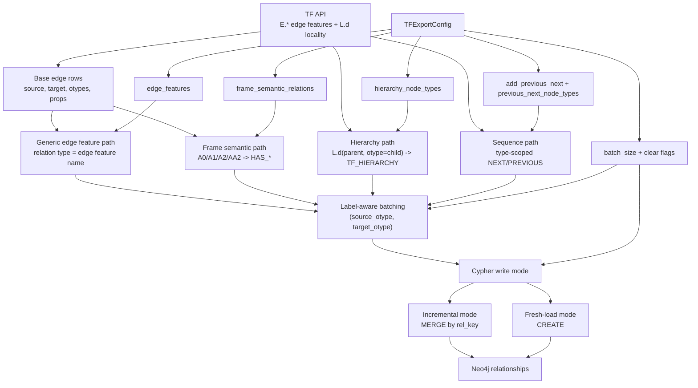

# Relation Pipeline

This diagram focuses on how relations are generated and written to Neo4j.

```mermaid
flowchart TD
    A["TF API<br/>E.* edge features + L.d locality"] --> B["Base edge rows<br/>source, target, otypes, props"]

    B --> C1["Generic edge feature path<br/>relation type = edge feature name"]
    B --> C2["Frame semantic path<br/>A0/A1/A2/AA2 -> HAS_*"]
    A --> C3["Hierarchy path<br/>L.d(parent, otype=child) -> TF_HIERARCHY"]
    A --> C4["Sequence path<br/>type-scoped NEXT/PREVIOUS"]

    C1 --> D["Label-aware batching<br/>(source_otype, target_otype)"]
    C2 --> D
    C3 --> D
    C4 --> D

    D --> E["Cypher write mode"]
    E --> E1["Incremental mode<br/>MERGE by rel_key"]
    E --> E2["Fresh-load mode<br/>CREATE"]

    E1 --> F["Neo4j relationships"]
    E2 --> F

    G["TFExportConfig"] --> G1["edge_features"]
    G --> G2["frame_semantic_relations"]
    G --> G3["hierarchy_node_types"]
    G --> G4["add_previous_next + previous_next_node_types"]
    G --> G5["batch_size + clear flags"]

    G1 --> C1
    G2 --> C2
    G3 --> C3
    G4 --> C4
    G5 --> D
    G5 --> E
```

